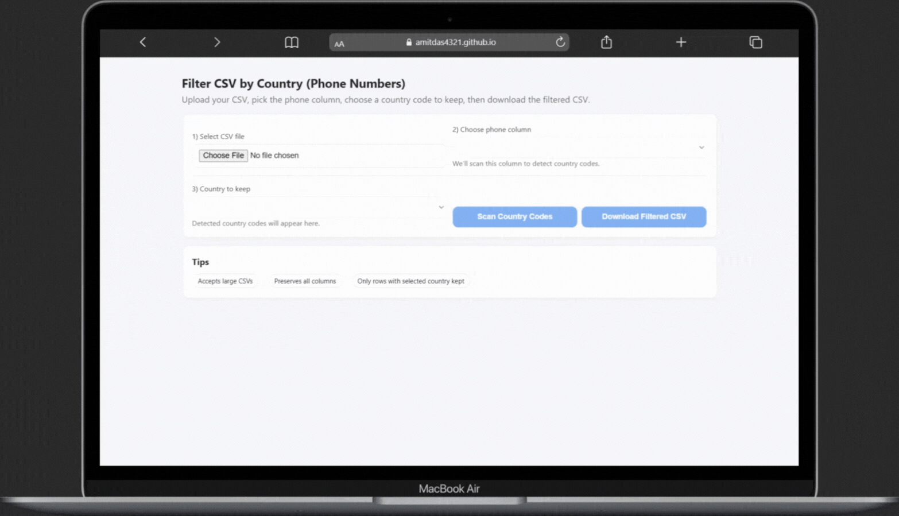

  

  <b>A lightweight browser-based tool that lets you upload a CSV, detect phone number country codes, and download a filtered file — fast, secure, and fully client-side.</b>

<h1 align="center">CSV Country Filter</h1>

  <b>Filter Phone Numbers by Country Instantly — Smart, Fast, and Secure!</b> 
 Version 1.0.0 • Developed by <a href="https://amitdas.site">AmitDas</a>

---

## 🎬 Demo

  

---

## 🚀 Overview  
CSV Country Filter lets you upload a CSV file, select the column containing phone numbers, automatically detect country calling codes, and export only the rows that match your selected country.  
Everything runs in your browser — no backend, no uploads, no data sharing.

---

## 🧰 Features  
✅ Upload CSV files (supports large files)  
✅ Detect international calling codes (E.164)  
✅ Choose a country code to keep  
✅ Download the filtered CSV instantly  
✅ 100% client-side — private and secure  
✅ Works offline after first load (if cached)

---

## 📂 How to Use  
1. Visit the live app → **[https://amitdas4321.github.io/CSV-Country-Filter/](https://amitdas4321.github.io/CSV-Country-Filter/)**  
2. Upload your `.csv` file.  
3. Select the column containing phone numbers.  
4. Click **“Scan Country Codes.”**  
5. Choose a country from the dropdown.  
6. Click **“Download Filtered CSV.”**

That’s it! 🎉 You’ll get a new CSV with only the selected country’s phone numbers.

---

## 🛠️ Technical Details  
- Built with **HTML**, **CSS**, and **Vanilla JavaScript**.  
- Uses **[PapaParse](https://www.papaparse.com/)** for CSV parsing and exporting.  
- Country code detection uses a pre-defined mapping of E.164 calling codes.  
- Performs normalization to strip `+`, `00`, and other non-digit symbols.  
- UI built with responsive, minimal CSS — works well on desktop and mobile.

---

## 👤 Author  
**Amit Das**  
- 🌐 Website: [https://amitdas.site](https://amitdas.site)  
- 🧑‍💻 GitHub: [https://github.com/AmitDas4321](https://github.com/AmitDas4321)

---

## 📄 License  
This project is licensed under the [MIT License](LICENSE).  
You are free to use, modify, and share it with credit.

---

## 💡 Tips  
- Works best if your phone numbers include country codes (`+91`, `+1`, etc.).  
- Rows without a country code appear under “LOCAL.”  
- Supports thousands of rows — all processed locally.  
- No data is sent to any server.

---

⭐ **If you found this project useful, please give it a star on GitHub!**
